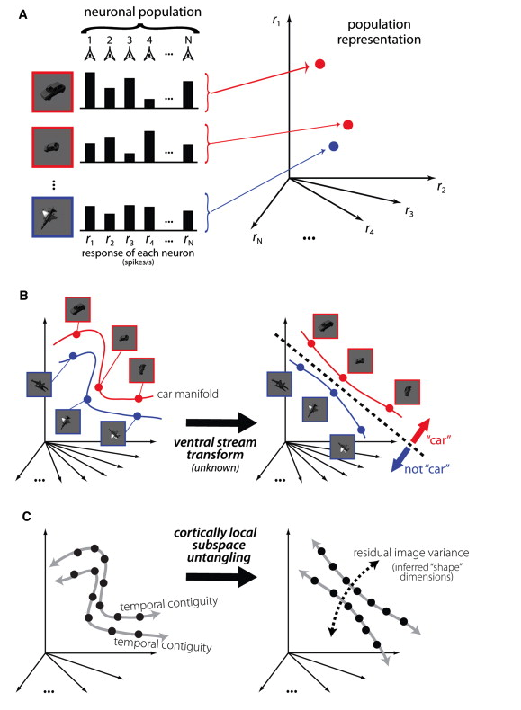
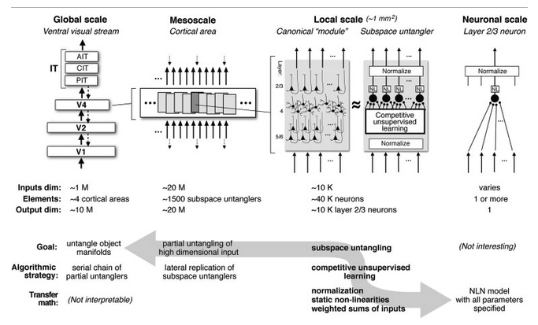
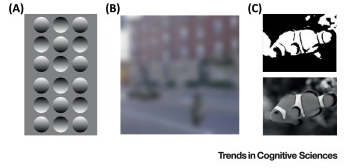

# How Do Biological Systems Process Visual Information? 

**Justin Dulay**

August 17th, 2021

-----------------------------

As practitioners of deep learning here in the year 2021, we often forget that neural networks themselves are biologically inspired.
These complicated mathematical machines maintain millions of parameters and
often can be shaped down to a series of individual, heavily interconnected
perceptrons with firing outputs dependent upon some formulated, thresholded activation function - or in the case of vision transformers, these rely more closely on multi-headed attention given upon learned features inherent to the data. 

We convolute learning with performance (`Top@1` accuracy, F1 Measures) too often to remember that learning is ultimately an unsupervised, competitive, and retained task within biological systems. They hold memory based upon strong-holding associations with objects in the past and can quickly infer upon vastly complex visual information new categories quickly on complex new information. 

In such, treating object recognition as a supervised learning task holds strong disadvantages, ones that we'll have to hold with a contradiction as our models continuously perform better on many supervised learning tasks. The disadvantages lie in the fact that there remain an infinite number of classes known in the world. As humans (competitive, unsupervised learners), we are able to draw _likeness_ comparisons on unrecognized, unknown classes. As referred to before within [the theory of novelty](https://www.wjscheirer.com/papers/wjs_aaai2021_novelty.pdf), novel classes are largely based upon this idea being unknown-unknown (UUC) - unknown at training and at test time. While machines can approximate values in open sets given their relationships to known-known [classes](https://www.wjscheirer.com/papers/wjs_tpami2017_evm.pdf), they often fall short when it comes to approximating and generalizing newly identified information. Learning takes skill and exposure. The largest foundation models at the time of this late 2021 articles like BERT and GPT-3 only work mostly within language domains; they fall exclusively on approximating based upon the encoding of parameters at large-scale. They _memorize concepts_, but they don't generalize information succinctly to learn new information to intelligently understand the world around them.

To move beyond the supervised learning framework for machine learning remains a daunting task. We would need to create a system that can not only generalize unknown information to singularity, approximate detangling that intelligent beings regularly perform with ease. To this date, this remains computationally infeasible due to unknown sizes and locations of neurons within the human brain. However, we can make approximations on some manifold untangling due to observations made within recent neuroscience experiments with corresponding explainable artificial modeling. Here, we'll introduce a few figures and talking points that bring us just a little bit closer to solving (re: approximating) this intelligence problem. 

-----------------------------

### Leveraging Machine Handling of Variance

One of the most challenging aspects of object recognition is handling intraclass variance. While data augmentation often helps traditional supervised machine learning tasks by extrapolating the [train set](https://link.springer.com/article/10.1186/s40537-019-0197-0), image augmentation within computer vision does little to help behavioral recognition within mammals. [DiCarlo et al.](https://www.sciencedirect.com/science/article/pii/S089662731200092X) demonstrate that data augmentation through image perturbation generates scalable item-response curves. These provide a sliding scale of recognition based with respect to the level of image perturbation. 

The manifold untangling abstraction within biological systems as conceptualized by DiCarlo et al. The demonstrability of a manifold space is easy within a scenario with few classes with very clear features. As more classes are added, and as existing classes are perturbed, recognition easily becomes an entangled manifold that remains an exceedingly complex problem to solve. Yet, advanced biological systems are able to differentiate readily within just a few milliseconds. The problem that emerges in both machine and biological systems is classifying images whenever heavy perturbation is involved. 

### Similarities in Visual Learning Pathways Between Biological Systems and Artificial Neural Networks

There is a lot going on with this figure from DiCarlo et al., so we'll unpack it some. At best, this serves a limited but true abstraction of the human visual processing pathway towards a neural network diagram. At a global scale (as seen in the top left portion of the image, we see the route of processing from the V1 cortex all the way through the IT cortices. The number of parameters is also important. The global scale has fewer input and output parameters, while the interior layers maintain several orders of magnitude more, just as in an artificial convolutional neural network. Likewise, the competitive unsupervised learning that occurs within the diagram _is just a rough abstraction_. However, the idea that we can define a framework for which low-level neurons within the mind communicate with one another is exciting! At a global scale, the task of untangling a complicated perceived object manifold is the result of the process of feedforwarding through millions of neurons at general, large-scale through minute local-scale neurons.

### A Case for Human Memorization Beyond Machine Leverage 

In order to push back against the aforementioned point that machines can often _see_ through noise better than humans, we would add that humans interpolate semantic meaning into otherwise noisy images. This may be used beneficially, incorrectly, and by proxy adversarially. This likely holds evolutionary benefits in being able to sense danger in an abundance of [caution](https://www.sciencedirect.com/science/article/pii/S1364661318301396). In a more generally intelligent case, this is often why humans experience unnecessary anxiety. Another case includes a child seeing monsters in the shadows of tree branches cast upon their nighttime window sill. Lange (and many others, I'm sure - forgive my lack of brevity) argues that priors remain highly important within recognition tasks and that misguided ones mean that humans will interpolate the wrongly generalized information. 

Lange et al. provide some examples of human misconception in image perturbation. The first figure shows various shadings on circles. The circles that are shaded on the top provide an appearance of a concave shape. In example b, the blurred image looks like a car and pedestrian on a street view; however, the car and pedestrian objects are rotated variations of the same black rectangle. In example c, the saturated blobs on the top would be semantically meaningless without the information of the clownfish image below it. 

We don't know a clear answer whether machines can handle these challenging examples more gracefully than humans. Will they fall to adversarial classifiers in the same way as humans, or will they be able to differentiate noise while also recognizing the misguided objects for what they are (whether they be adversarial or just generally challenging)? 

### What Should We Do with This?
The brain is an extraordinarily complex system that humans are only beginning to understand. Likewise, neural networks are a long way off from reaching human-like, generalized artificial intelligence. But not all appear dismal. For starters, machine learning outperforms humans on specific, supervised tasks, such as playing games like chess or go. Likewise, we can merit the best of both worlds by improving supervised learning through parameterizing the label space with [psychophysical labels](./parameterizing-psychophysics.html). By levering some human intuition, we can already make some machine learning systems better. 