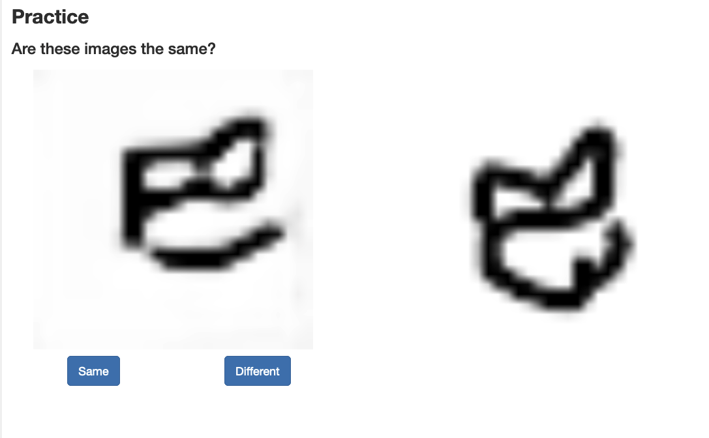
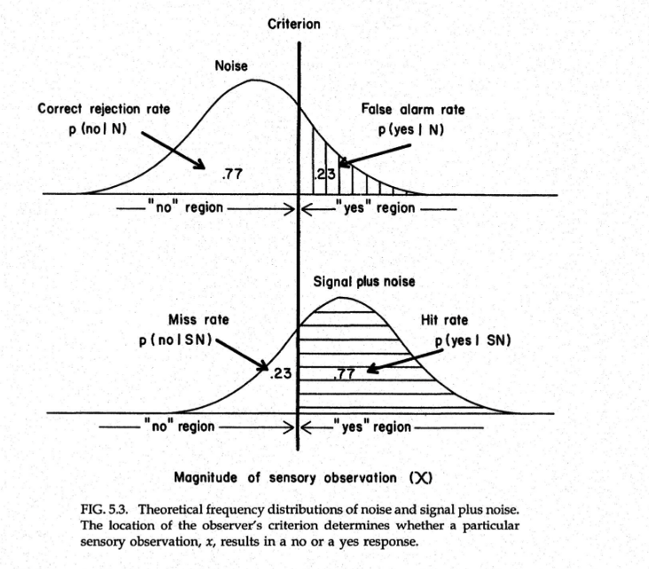
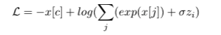
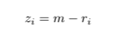

# Parameterizing Psychophysics in a Neural Network 

**Justin Dulay**

July 30th 2021

-----------------------------

Deep learning uses a wealth of resources today, from 100s of GPUs to state-of-the-art models, to massive datasets and self-supervised systems. Yet, we don't utilize psychophysical parameters enough. 

### Psychophysics

Visual psychophysics began as a field of [study](http://psiwebsubr.org/Fechner.pdf) long before computer vision. Psychophysics is the measurement of human perception as related to external stimuli. For example, a Two-Alternative Forced Choice task ([2AFC](https://en.wikipedia.org/wiki/Two-alternative_forced_choice)) is a scenario in which a human subject is asked question that necessitates a yes/no answer, and they cannot answer anything else besides yes or no. This setup forces the reviewer to react according to their best judgements in an uncertain or novel scenario. While 100% confidence on questions may not be guranateed, confidence in each answer always remains present on a *variable, quantifiable level*. Because of this, the reviewer may take longer on harder questions and shorter on easier questions. This implicitly allows for the psychophysical annotation of problems, meaning we can use the [reaction time associated with a question as a parameter](https://www.wjscheirer.com/papers/wjs_tpami2014_perceptual.pdf) for further use. Recently, we asked people on the popular Amazon [MTurk](https://www.mturk.com/) platform a series of 2AFC annotation tasks. As seen in the figure below, we asked participants whether the figures where the same or not, and we recorded their 
accuracies and reaction times as psychophysical measurements against the stimulus tasks. 



In the above case, they clearly remain the same; however, response accuracy can vary greatly with increasingly complex images. In other words, simple images remain easy for reviewers to quickly classify, while complex images show more variance in both reaction time and classification accuracy. The variance in questions is correlated to the complexity or noise from the HIT images. So far, this largely aligns with [Signal Detection Theory](https://www.amazon.com/Psychophysics-Fundamentals-George-Gescheider/dp/080582281X). 




In our 2AFC case, the signal flips on and off all the time. However, the curve moves frequently to the left or right, dependent upon the complexity of the class. Complex images are both noisy and hard to classify correctly, while simple images are less noisy and easier to classify. 


### Deep Learning 

After gathering the reaction times for paired images, we created a dataset that included paired images with associated reaction time penalties. Likwise, we also formulated a loss function the modifies cross entropy loss to include for psychophysical annotations. 



where sigma is a scaling factor and z is the psychophysical penality incurred from reaction time: 




In most cases, the maximum reaction time was around 30 seconds, and the minimum was around 1 second. 

While further experiments are being conducted, the code for parameterizing cross entropy loss remains straightforward. 

```python
import torch

def PsychCrossEntropyLoss(outputs, targets, psych):
    num_examples = targets.shape[0]
    batch_size = outputs.shape[0]

    # converting reaction time to penalty
    # 30000 is close to the max penalty time seen in the data
    for idx in range(len(psych)):   
        psych[idx] = abs(30000 - psych[idx])

    # adding penalty to each of the output logits 
    # but it's too severe and outweighs the rest of the loss
    # scaling seems to somewhat work
    for i in range(len(outputs)):
        outputs[i] += (psych[i] / 1000)

    outputs = _log_softmax(outputs)
    outputs = outputs[range(batch_size), targets]

    return - torch.sum(outputs)/num_examples


def _softmax(x):
    exp_x = torch.exp(x)
    sum_x = torch.sum(exp_x, dim=1, keepdim=True)

    return exp_x/sum_x

def _log_softmax(x):
    return torch.log(_softmax(x))
```


In future work, we'd like to incorporate more types of psychophysical annotations into parameters (like accuracy, eye movement) and modify different types of loss functions besides vanilla cross entropy loss. 


###### *These experiments are on-going and subject to change.*